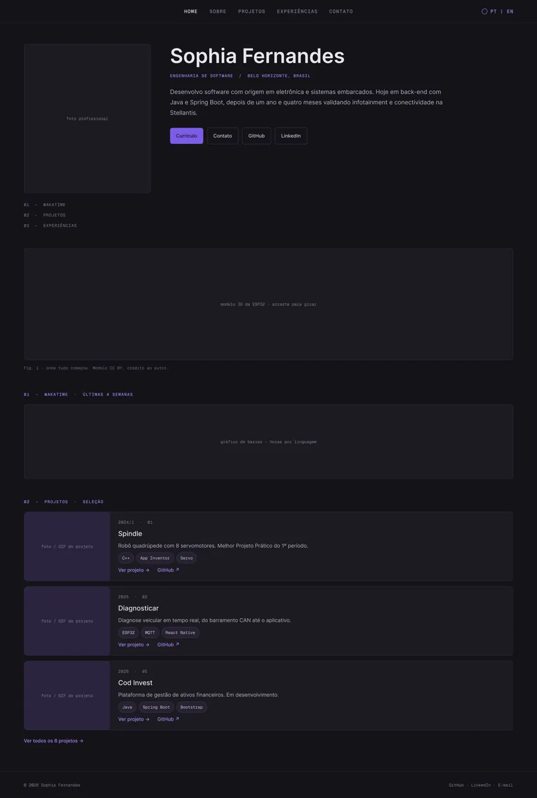
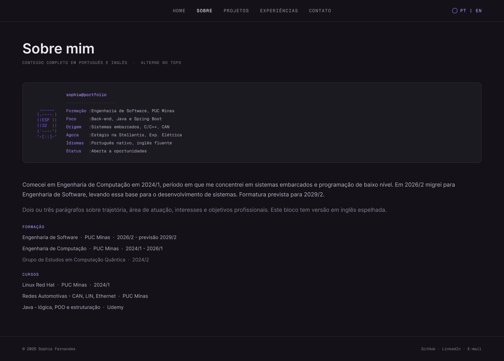
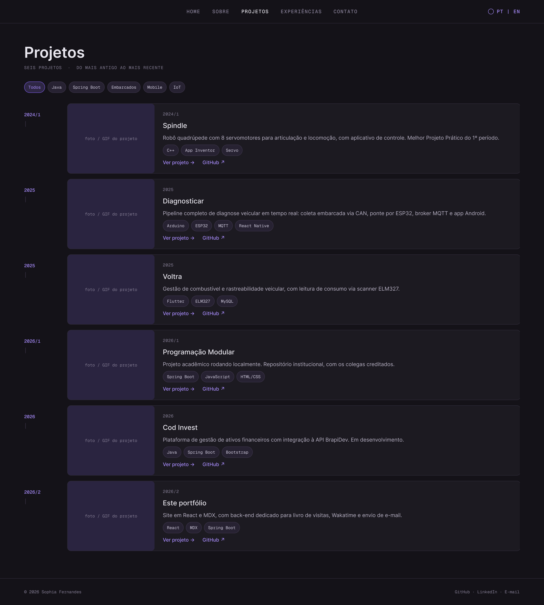
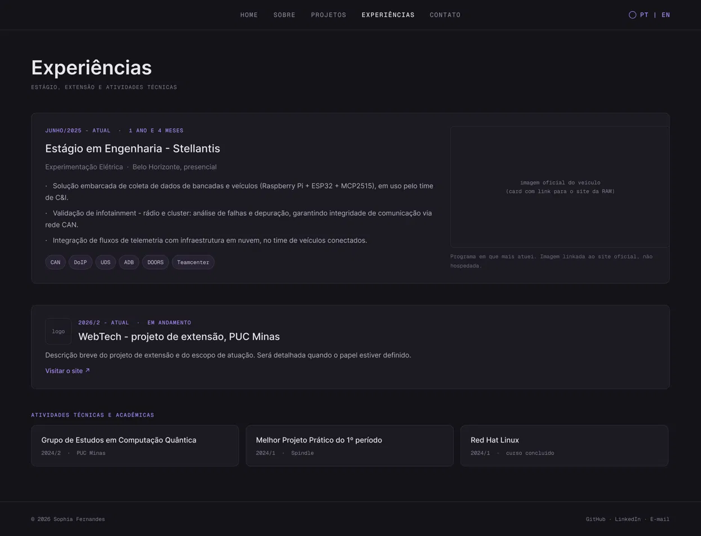
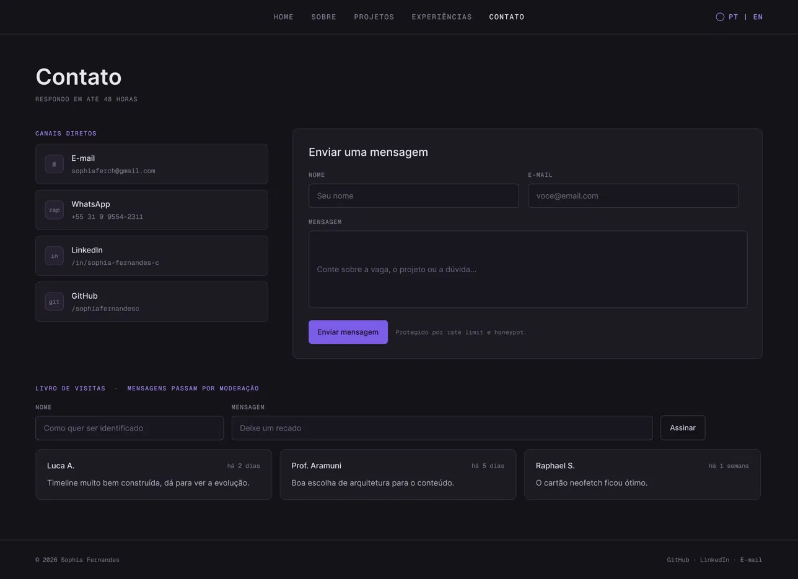

# 🏷️ Portfólio Profissional -Sophia Fernandes 👨‍💻

> [!NOTE]
> Site de portfólio profissional que reúne trajetória, projetos, experiências e formas de contato, em português e inglês.
> Conteúdo versionado em arquivos MDX: cada projeto é um arquivo, o que mantém a documentação do projeto junto do código.

<table>
  <tr>
    <td width="800px">
      <div align="justify">
        Este projeto é o <b>Laboratório 01</b> da disciplina <b>DIAW -Desenvolvimento e Integração de Aplicações Web</b>, do curso de Engenharia de Software da PUC Minas. O objetivo é projetar e desenvolver um website de portfólio profissional, cobrindo <i>front-end</i>, <i>back-end</i> e <i>hospedagem na nuvem</i>. O site apresenta uma seção <b>Sobre Mim</b> bilíngue, uma <b>linha do tempo de projetos</b> do mais antigo ao mais recente, as <b>experiências profissionais e acadêmicas</b> e uma página de <b>contato</b> com formulário funcional. Além dos requisitos obrigatórios, o projeto exibe um <b>gráfico de horas de código</b> a partir da API do Wakatime.
      </div>
    </td>
    <td>
    </td>
  </tr>
</table>

---

## 🚧 Status do Projeto

> [!WARNING]
> **Em desenvolvimento -Sprint 01 (planejamento e prototipação).**
> Sprint 01 entrega planejamento, wireframes e Design System. O código da aplicação entra na Sprint 02.

[](https://github.com/sophiafernandesc/sophiafernandes-portfolio/releases)


---

## 📚 Índice
- [Links Úteis](#-links-úteis)
- [Sobre o Projeto](#-sobre-o-projeto)
- [Funcionalidades Principais](#-funcionalidades-principais)
- [Tecnologias Utilizadas](#-tecnologias-utilizadas)
- [Arquitetura](#-arquitetura)
  - [Visão geral da stack](#visão-geral-da-stack)
  - [Como o MDX funciona neste projeto](#como-o-mdx-funciona-neste-projeto)
  - [Decisões e trade-offs](#decisões-e-trade-offs)
- [Instalação e Execução](#-instalação-e-execução)
  - [Pré-requisitos](#pré-requisitos)
  - [Variáveis de Ambiente](#-variáveis-de-ambiente)
  - [Instalação de Dependências](#-instalação-de-dependências)
  - [Como Executar a Aplicação](#-como-executar-a-aplicação)
- [Deploy](#-deploy)
- [Estrutura de Pastas](#-estrutura-de-pastas)
- [Demonstração](#-demonstração)
- [Testes](#-testes)
- [Documentações utilizadas](#-documentações-utilizadas)
- [Autores](#-autores)
- [Contribuição](#-contribuição)
- [Agradecimentos](#-agradecimentos)
- [Licença](#-licença)

---

## 🔗 Links Úteis

* 🌐 **Demo Online:** _A publicar na Sprint 03._
  > 💻 Front-end hospedado na Vercel.
* 🎨 **Protótipos (Figma):** [Wireframes e Design System](https://www.figma.com/design/rZBIBF1oWuGe6IK20gs4RA/Portfolio)
  > 📐 Wireframes de média fidelidade das cinco páginas, versão mobile da home e o Design System com cores e tipografia.
* 📄 **Currículo:** _A publicar junto com o site._

---

## 📝 Sobre o Projeto

O portfólio nasceu de uma necessidade concreta: reunir num só lugar uma trajetória que começou em eletrônica e sistemas embarcados e hoje se concentra em desenvolvimento de software. Currículo em PDF e perfil do LinkedIn não dão conta de mostrar um pipeline que vai do barramento CAN até a tela de um aplicativo -precisa de imagem, de GIF e de espaço para explicar decisão de arquitetura.

**Qual problema resolve.** Um recrutador tem poucos minutos e precisa entender, rápido, o que a pessoa já construiu e com o quê. O site organiza isso em uma linha do tempo cronológica, em que cada projeto traz descrição, tecnologias, evidência visual e link para o repositório -e, quando o projeto merece, uma página própria com arquitetura e capturas de tela.

**Contexto.** Acadêmico e profissional ao mesmo tempo: é o Laboratório 01 da disciplina DIAW, avaliado em 15 pontos distribuídos em três sprints, e também uma peça real de apresentação profissional, que continua no ar depois da entrega.

**O que o torna diferente.** A progressão da linha do tempo é o próprio argumento: de um robô quadrúpede em C++ em 2024 a uma plataforma full-stack em Java e Spring Boot em 2026. A origem em embarcados não é um detalhe do passado, é o diferencial que explica a forma de resolver problema.

---

## ✨ Funcionalidades Principais

**Obrigatórias (enunciado):**

- 🌐 **Sobre Mim bilíngue:** apresentação completa em português e inglês, com alternância de idioma em todo o site.
- 🗓️ **Linha do tempo de projetos:** ordenada do mais antigo ao mais recente, com nome, descrição, tecnologias, link do repositório e imagem ou GIF de cada projeto.
- 💼 **Experiências:** estágio, projeto de extensão e atividades técnicas, com instituição, cargo, período e descrição.
- 📨 **Contato:** ícones clicáveis para e-mail, WhatsApp, LinkedIn e GitHub, mais formulário com nome, e-mail e mensagem, com envio por e-mail.
- 📱 **Design responsivo:** layout validado em largura de celular.

**Adicionais desta entrega:**

- 📊 **Horas de código:** gráfico de barras com dados da API do Wakatime, consumidos por um proxy no back-end para não expor a chave.
- 📑 **Páginas de detalhe por projeto:** arquitetura, diagramas e capturas de tela, escritas em MDX.

**Backlog (fora do escopo desta entrega):**

- 📖 **Livro de visitas:** mensagens públicas de quem visita o site, com moderação e proteção contra spam. Adiado por exigir persistência, banco de dados e fluxo de moderação -será implementado depois da entrega da disciplina.

---

## 🛠 Tecnologias Utilizadas

### 💻 Front-end

* **Framework/Biblioteca:** React 19
* **Conteúdo:** MDX 3 -cada projeto é um arquivo `.mdx` com frontmatter padronizado
* **Linguagem:** JavaScript ES6+
* **Build Tool:** Vite 7
* **Roteamento:** React Router
* **Estilização:** CSS Modules com variáveis de tema
* **Internacionalização:** react-i18next
* **Plugins MDX:** `@mdx-js/rollup`, `remark-frontmatter`, `remark-mdx-frontmatter`

### 🖥️ Back-end

* **Linguagem/Runtime:** Java 25 (JDK)
* **Framework:** Spring Boot 3.3
* **E-mail:** Spring Mail (JavaMailSender)
* **Cliente HTTP:** RestClient, para consumir a API do Wakatime

> [!NOTE]
> O back-end é **stateless**: não há banco de dados nesta entrega. Os dois endpoints apenas encaminham requisições -um para a API do Wakatime, outro para o servidor de e-mail. O banco entra junto com o livro de visitas, que está no backlog.

### ⚙️ Infraestrutura & DevOps

* **Cloud (front-end):** Vercel
* **Cloud (back-end):** Render
* **Versionamento:** Git e GitHub
* **Design:** Figma -wireframes e Design System

### 🎨 Design System

* **Tipografia:** Inter na interface, Geist Mono em metadados e números
* **Tema:** base escura com acento roxo (`#7C5CE6` e `#A78BFA`)
* Documentado em [`docs/design-system.md`](./docs/design-system.md) e no [arquivo do Figma](https://www.figma.com/design/rZBIBF1oWuGe6IK20gs4RA/Portfolio)

---

## 🏗 Arquitetura

A aplicação é dividida em duas partes independentes, com responsabilidades bem separadas: um **front-end estático** que carrega todo o conteúdo e um **back-end mínimo** que responde apenas pelo que não cabe em arquivo estático.

### Visão geral da stack

```
┌─────────────────────────────────────────────────────────────┐
│  CONTEÚDO (versionado no Git)                               │
│  arquivos .mdx  ·  frontmatter + corpo  ·  pt / en          │
└──────────────────────────┬──────────────────────────────────┘
                           │ compilado no build
                           ▼
┌─────────────────────────────────────────────────────────────┐
│  FRONT-END  ·  React 19 + Vite 7 + MDX 3                    │
│  React Router  ·  react-i18next  ·  CSS Modules             │
│  Hospedagem: Vercel (site estático)                         │
└──────────────────────────┬──────────────────────────────────┘
                           │ HTTPS
                           ▼
┌─────────────────────────────────────────────────────────────┐
│  BACK-END  ·  Java 25 + Spring Boot 3.3  (stateless)        │
│                                                             │
│   GET  /api/wakatime   ──►  API do Wakatime                 │
│   POST /api/contact    ──►  SMTP                            │
│                                                             │
│  Hospedagem: Render                                         │
└─────────────────────────────────────────────────────────────┘
```

**Por que essa separação.** Planos gratuitos de hospedagem para aplicações com back-end hibernam após um período de inatividade, e o primeiro acesso paga o custo de acordar o serviço. Mantendo o conteúdo estático, esse custo nunca recai sobre quem abre o site: no pior caso, apenas o gráfico do Wakatime demora a aparecer, e o restante da página já está renderizado.

**Por que o back-end existe.** Os dois endpoints têm o mesmo motivo de ser: **segredo não pode ir para o cliente**. A chave da API do Wakatime e as credenciais de SMTP ficam no servidor, nunca no bundle do front-end.

### Como o MDX funciona neste projeto

MDX é Markdown que aceita componentes React. Um compilador transforma cada arquivo `.mdx` num **módulo JavaScript** durante o build -o navegador nunca recebe o arquivo original. Cada arquivo exporta duas coisas:

| Export | O que é | Onde é usado |
| :--- | :--- | :--- |
| `frontmatter` | O bloco YAML no topo, extraído pelo `remark-mdx-frontmatter` | Cards, ordenação da linha do tempo, filtros por stack |
| `default` | O corpo do arquivo, compilado como componente React | Página de detalhe do projeto |

Um arquivo de projeto fica assim:

```mdx
---
slug: diagnosticar
titulo: Diagnosticar
ano: 2025
ordem: 2
stack: [Arduino Nano, MCP2515, ESP32, MQTT, React Native]
repo: https://github.com/sophiafernandesc/esp32-canbus-obd2-project
capa: /img/projetos/diagnosticar.png
tags: [IoT, Embarcados, Mobile]
---

Pipeline completo de diagnose veicular em tempo real, com coleta
embarcada via CAN, ponte por ESP32 e broker MQTT.

<Diagrama src="/img/projetos/diagnosticar-arquitetura.svg" />
```

A listagem é montada varrendo a pasta de uma vez só, sem registro manual em nenhum arquivo central:

```js
const modulos = import.meta.glob('./conteudo/projetos/pt/*.mdx', { eager: true });

export const projetos = Object.values(modulos)
  .map((m) => ({ ...m.frontmatter, Corpo: m.default }))
  .sort((a, b) => a.ordem - b.ordem);
```

**O fluxo de trabalho que isso cria:** para publicar um projeto novo, basta criar o arquivo, preencher o frontmatter, escrever o corpo e dar `git push`. O card aparece na posição correta da linha do tempo sozinho, e a página de detalhe passa a existir. Nenhum painel administrativo, nenhum banco de dados e nenhum arquivo central para manter sincronizado.

O `MDXProvider`, montado no `main.jsx`, mapeia os elementos do Markdown para os componentes do Design System -títulos, blocos de código e figuras saem estilizados sem precisar de classe dentro do conteúdo.

### Decisões e trade-offs

| Decisão | Motivo | Trade-off aceito |
| :--- | :--- | :--- |
| Conteúdo em MDX, não em banco | Versionado no Git, sem painel para manter | Publicar exige commit e build |
| Back-end separado, não monolito | Site nunca sofre com cold start | Dois deploys para gerenciar |
| Back-end sem banco de dados | Nada a persistir nesta entrega | Livro de visitas fica para depois |
| Pastas bilíngues desde o início | Adaptar i18n depois é o pior retrabalho | Dobra os arquivos de conteúdo |
| Chave do Wakatime no servidor | Chave de API nunca pode ir ao cliente | Gráfico depende do back-end no ar |

### Exemplos de diagramas

| Diagrama | Descrição |
| :---: | :---: |
| **Visão Geral** | **Modelo de Conteúdo** |
| <!-- TODO: adicionar diagrama --> | <!-- TODO: adicionar diagrama --> |

---

## 🔧 Instalação e Execução

### Pré-requisitos

* **Node.js:** v20 LTS ou superior -necessário para o front-end
* **npm:** v10 ou superior
* **Java JDK:** 17 ou superior -necessário para o back-end

> [!TIP]
> Não há banco de dados nesta versão, então o Docker não é necessário para rodar o projeto localmente.

---

### 🔑 Variáveis de Ambiente

#### Front-end (`/frontend/.env.local`)

| Variável | Descrição | Exemplo |
| :--- | :--- | :--- |
| `VITE_API_URL` | URL base do back-end | `http://localhost:8080/api` |

#### Back-end (variáveis de ambiente do sistema ou `application.yml`)

| Variável | Descrição | Exemplo |
| :--- | :--- | :--- |
| `SERVER_PORT` | Porta do back-end | `8080` |
| `WAKATIME_API_KEY` | Chave da API do Wakatime | `waka_...` |
| `MAIL_HOST` | Servidor SMTP | `smtp.gmail.com` |
| `MAIL_USERNAME` | Conta de envio | `contato@exemplo.com` |
| `MAIL_PASSWORD` | Senha de aplicativo do SMTP | `senha_de_app` |
| `CONTACT_TO` | Destinatário do formulário de contato | `sophiaferch@gmail.com` |
| `CORS_ORIGIN` | Domínio do front-end autorizado | `http://localhost:5173` |

> [!CAUTION]
> `WAKATIME_API_KEY` e `MAIL_PASSWORD` **nunca** devem aparecer no front-end nem ser versionadas. Use `.env.example` como referência e mantenha os arquivos reais no `.gitignore`.

---

### 📦 Instalação de Dependências

```bash
git clone https://github.com/sophiafernandesc/sophiafernandes-portfolio.git
cd sophiafernandes-portfolio
```

#### Front-end

```bash
cd frontend
npm install
cd ..
```

#### Back-end

```bash
cd backend
./mvnw clean install
cd ..
```

---

### ⚡ Como Executar a Aplicação

#### Terminal 1: Back-end (Spring Boot)

```bash
cd backend
./mvnw spring-boot:run
```

🚀 *Disponível em **http://localhost:8080**.*

#### Terminal 2: Front-end (React + Vite)

```bash
cd frontend
npm run dev
```

🎨 *Disponível em **http://localhost:5173**.*

> [!TIP]
> O front-end funciona sozinho, sem o back-end no ar. Nesse caso, o gráfico do Wakatime exibe estado vazio e o formulário de contato fica indisponível, enquanto o resto do site opera normalmente -que é o comportamento esperado em produção também.

---

## 🚀 Deploy

```bash
# Front-end -gera a pasta /dist com arquivos estáticos
cd frontend
npm run build

# Back-end -gera o .jar executável em /target
cd ../backend
./mvnw clean package
```

**Front-end (Vercel):** conectar o repositório, definir `frontend` como diretório raiz, build com `npm run build` e saída em `dist`. Configurar `VITE_API_URL` apontando para a URL de produção do back-end.

**Back-end (Render):** serviço Web a partir do `Dockerfile` ou do `.jar`, com as variáveis de ambiente da tabela acima.

> [!NOTE]
> Configure `CORS_ORIGIN` com o domínio de produção do front-end, senão o navegador bloqueia as chamadas à API.

---

## 📂 Estrutura de Pastas

```
.
├── .gitignore
├── README.md
├── LICENSE
├── /docs                            # 📚 Documentação
│   └── design-system.md             # 🎨 Cores, tipografia e regras de uso
│
├── /frontend                        # 📁 Aplicação React + MDX
│   ├── .env.example
│   ├── vite.config.js               # ⚙️ Plugins do MDX e do React
│   ├── /public
│   │   └── /img                     # 🖼️ Capas e GIFs dos projetos
│   ├── /src
│   │   ├── main.jsx                 # 🚪 Entrada da aplicação e MDXProvider
│   │   ├── /components              # 🧱 Nav, CardProjeto, Neofetch, Timeline, Formulario
│   │   ├── /pages                   # 📄 Home, Sobre, Projetos, Experiencias, Contato
│   │   ├── /conteudo                # 📝 Conteúdo em MDX, bilíngue
│   │   │   ├── projetos.js          # 🔍 Varre as pastas e exporta a lista ordenada
│   │   │   ├── /projetos
│   │   │   │   ├── /pt              # 🇧🇷 spindle.mdx, diagnosticar.mdx, ...
│   │   │   │   └── /en              # 🇺🇸 mesmos arquivos, em inglês
│   │   │   └── /experiencias
│   │   │       ├── /pt
│   │   │       └── /en
│   │   ├── /services                # 🔌 Chamadas ao back-end
│   │   ├── /hooks                   # 🎣 useProjetos, useIdioma
│   │   ├── /styles                  # 🎨 Tokens do Design System e mapa do MDXProvider
│   │   └── /utils
│   └── package.json
│
└── /backend                         # 📁 Aplicação Spring Boot (stateless)
    ├── /src/main/java/com/sophiafernandes/portfolio
    │   ├── /controller              # 🎮 WakatimeController, ContactController
    │   ├── /service                 # ⚙️ Integração com Wakatime e envio de e-mail
    │   ├── /dto                     # ✉️ DTOs de entrada e saída
    │   └── /config                  # 🔧 CORS, RestClient e configuração de e-mail
    ├── /src/main/resources
    │   └── application.yml
    ├── /src/test/java
    └── pom.xml
```

---

## 🎥 Demonstração

> [!WARNING]
> Capturas e GIFs serão adicionados na Sprint 03, com o site publicado. Projetos com hardware entram com foto; os demais, com GIF em execução.

### 🌐 Aplicação Web

| Tela | Captura de Tela |
| :---: | :---: |
| **Home** | **Projetos** |
| <!-- TODO --> | <!-- TODO --> |
| **Sobre Mim** | **Contato** |
| <!-- TODO --> | <!-- TODO --> |

### 📐 Wireframes (Sprint 01)

Média fidelidade, exportados do [arquivo do Figma](https://www.figma.com/design/rZBIBF1oWuGe6IK20gs4RA/Portfolio). Base escura com acento roxo, Inter na interface e Geist Mono em metadados.

| Home | Sobre mim |
| :---: | :---: |
|  |  |
| Hero, figura do hardware, Wakatime e seleção de projetos | Cartão neofetch, trajetória, formação e cursos |

| Projetos | Experiências |
| :---: | :---: |
|  |  |
| Filtros por stack e trilha cronológica dos seis projetos | Estágio, projeto de extensão e atividades técnicas |

| Contato |
| :---: |
|  |
| Canais diretos, formulário de mensagem e livro de visitas |

> [!NOTE]
> O livro de visitas aparece no wireframe porque o protótipo foi desenhado antes do corte de escopo. Ele está no backlog e não entra nesta entrega.

---

## 🧪 Testes

### Front-end

```bash
cd frontend
npm run test
```

*Ferramenta: Vitest com Testing Library.*

### Back-end

```bash
cd backend
./mvnw test
```

*Ferramenta: JUnit 5 com MockMvc.*

> [!NOTE]
> Cobertura prevista para a Sprint 03: validação do formulário de contato, ordenação da linha do tempo a partir do frontmatter e os dois endpoints do back-end.

---

## 🔗 Documentações utilizadas

* 📖 **Front-end:** [Documentação oficial do **React**](https://react.dev/reference/react)
* 📖 **Conteúdo:** [Documentação do **MDX**](https://mdxjs.com/docs/)
* 📖 **Integração MDX + Vite:** [**@mdx-js/rollup**](https://mdxjs.com/packages/rollup/)
* 📖 **Build Tool:** [Guia de configuração do **Vite**](https://vitejs.dev/config/)
* 📖 **Back-end:** [Documentação oficial do **Spring Boot**](https://docs.spring.io/spring-boot/docs/current/reference/html/)
* 📖 **API externa:** [**Wakatime API**](https://wakatime.com/developers)
* 📖 **Internacionalização:** [**react-i18next**](https://react.i18next.com/)
* 📖 **Guia de estilo:** [**Conventional Commits**](https://www.conventionalcommits.org/en/v1.0.0/)
* 📖 **Documentação interna:** [Design System do Projeto](./docs/design-system.md)

---

## 👥 Autores

| 👤 Nome | :octocat: GitHub | 💼 LinkedIn | 📤 Gmail |
|---------|-----------------|-------------|-----------|
| Sophia da Costa Fernandes | [@sophiafernandesc](https://github.com/sophiafernandesc) | [sophia-fernandes-c](https://www.linkedin.com/in/sophia-fernandes-c) | [sophiaferch@gmail.com](mailto:sophiaferch@gmail.com) |

---

## 🤝 Contribuição

1. Faça um `fork` do projeto.
2. Crie uma branch para sua feature (`git checkout -b feature/minha-feature`).
3. Commit suas mudanças (`git commit -m 'feat: adiciona funcionalidade X'`), seguindo [Conventional Commits](https://www.conventionalcommits.org/en/v1.0.0/).
4. Faça o `push` para a branch (`git push origin feature/minha-feature`).
5. Abra um **Pull Request**.

---

## 🙏 Agradecimentos

* [**Engenharia de Software PUC Minas**](https://www.instagram.com/engsoftwarepucminas/) -pela estrutura acadêmica e pelo fomento às boas práticas de engenharia.
* [**Prof. Dr. João Paulo Aramuni**](https://github.com/joaopauloaramuni) -pela orientação na disciplina de DIAW e pelo template de documentação adotado neste projeto.
* **Referências de portfólio** que inspiraram decisões de design: [Raphael Sena](https://www.raphaelsena.com/), [Luca Azalim](https://azal.im/) e [Abdul Momin](https://abdulmomin.dev/).

---

## 📄 Licença

Este projeto é distribuído sob a **[Licença MIT](./LICENSE)**.

---